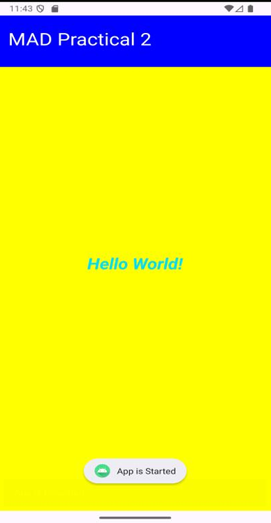
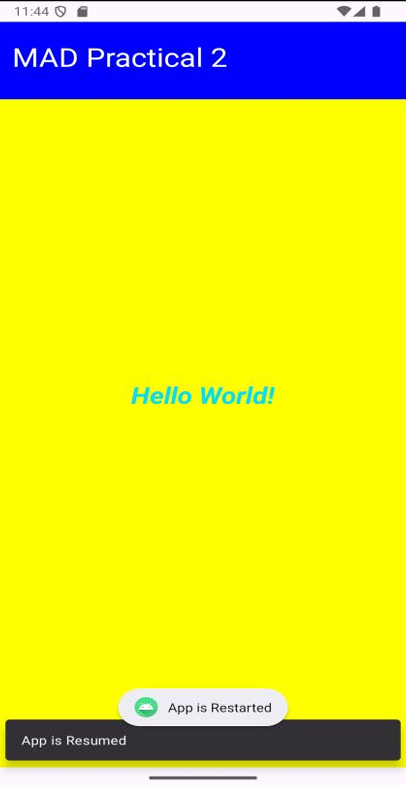
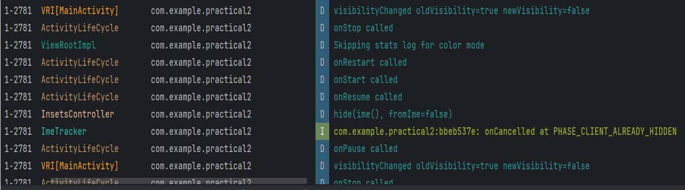

# Practical 2 – Android Activity Lifecycle Demonstration

This Android application demonstrates how **Activity Lifecycle methods** work using **Toast**, **Snackbar**, and **Logcat** messages. It uses a simple UI built using `ConstraintLayout`.

---

## Features

-  Simple and clean UI using `ConstraintLayout`
-  Displays **Toast** and **Snackbar** messages for lifecycle events
-  Logs lifecycle states using **Logcat**
-  Demonstrates all major lifecycle callbacks:
  - `onCreate`
  - `onStart`
  - `onResume`
  - `onPause`
  - `onStop`
  - `onRestart`
  - `onDestroy`
-  Uses modern edge-to-edge layout

---

## Screenshots

### Toast & Snackbar Example

<p align="left">
  
  
</p>

### Logcat Output



---

## Project Structure
```
app/
├── java/com/example/practical2/
│   └── MainActivity.kt
└── res/layout/
    └── activity_main.xml
```

---

## How It Works

### `onCreate()`
- Loads layout  
- Enables edge-to-edge UI  
- Shows Toast and Snackbar  
- Logs event in Logcat  

### `onStart()` / `onResume()`
- Shows Toast messages  
- Displays Snackbar  
- Logs lifecycle states  

### `onPause()`
- Shows pause Toast  
- Logs pause event  

### `onStop()` / `onRestart()` / `onDestroy()`
- Displays relevant Toast  
- Logs lifecycle updates  

---

## Running the App

1. Open the project in **Android Studio**
2. Connect a device or start an emulator
3. Press **Run** ️
4. Interact with the app to trigger lifecycle changes:
   - Open / Close / Minimize the app  
   - Rotate screen  
   - Move app to background  
5. Observe:
   - Toast popups  
   - Snackbar messages  
   - Logcat lifecycle logs  

---

## Main Files

### `MainActivity.kt`
Contains:
- Lifecycle overrides  
- Toast & Snackbar usage  
- Logcat debugging  

### `activity_main.xml`
Defines a simple layout with:
- A blue title section  
- A central message text  

---
## Author

**Aashish Sah**  
- GitHub: [@aashishsah005](https://github.com/aashishsah005)
- Email: aashishsah005@gmail.com

---

## Acknowledgments

- Kotlin Official Documentation
- JetBrains Kotlin Tutorials
- Stack Overflow Community
- Android Developers Kotlin Guide

---

## Support

If you found this project helpful, please give it a ⭐ on GitHub!

---